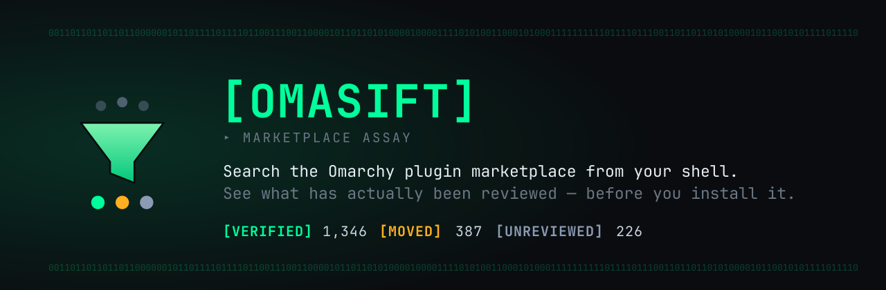
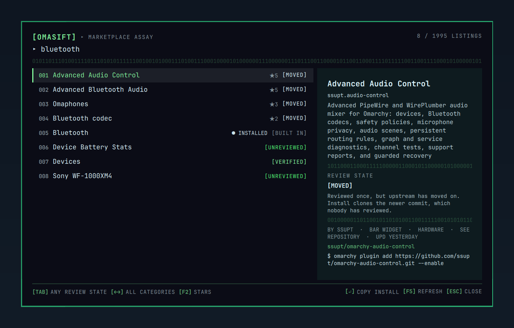
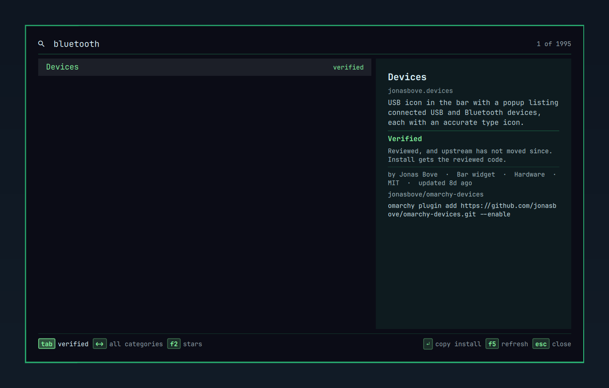

<div align="center">



**Search the Omarchy plugin marketplace from your shell — and see what has actually been reviewed before you install it.**

[](LICENSE)


</div>

## The problem

The marketplace has grown past the point where anyone can browse it. There are
**1,995 listings**, 87% of them bar widgets, and the badge on each one says
either *verified* or *unverified*.

That single word hides something. A listing is verified at one commit.
`omarchy plugin add` clones whatever upstream `HEAD` is **now**. When those
differ, the marketplace quietly downgrades the badge to unverified — putting
two very different situations under the same label:

| | | Today |
|---|---|--:|
| 🟢 **Verified** | Reviewed, and upstream has not moved. Install gets the reviewed code. | 1,346 |
| 🟠 **Verified, then moved** | Reviewed once, but upstream moved on. Install clones a newer commit **nobody reviewed**. | 387 |
| ⚪ **Never reviewed** | Nobody has ever looked at it. | 226 |

387 plugins were reviewed and then changed. 226 were never looked at. A binary
badge tells you the same thing about both.

## What OmaSift does

It splits them, and lets you filter on the difference.

<table>
<tr>
<td width="50%"></td>
<td width="50%"></td>
</tr>
<tr>
<td align="center"><code>bluetooth</code> → <b>8 plugins</b></td>
<td align="center"><kbd>Tab</kbd> → <b>1 is actually verified</b></td>
</tr>
</table>

Fullscreen, keyboard-first, and it opens in about as long as it takes to read
this sentence. One line per result: index, name, stars, review state.

### The look

OmaSift reads as an instrument, not a store: a bracket wordmark, a bit-run for a
rule, zero-padded row indices, and `[VERIFIED]` / `[MOVED]` / `[UNREVIEWED]` as
badges rather than prose. Three colours carry the whole model — neon for
reviewed, amber for reviewed-then-moved, steel for never-looked-at — and they
are the same three dots in the logo.

Amber and steel are deliberate. The marketplace is explicit that unverified
"is not a claim that the plugin is malicious", so nothing here is painted red.

If you would rather the desktop look like one thing, set `palette` to `shell`
and every colour comes from your active Omarchy theme instead.

## Install

```bash
omarchy plugin add https://github.com/labrat-0/omarchy-omasift.git
omarchy plugin enable io.github.labrat-0.omasift --section right
```

Click the bar icon, or bind it:

```bash
omarchy-shell shell toggle io.github.labrat-0.omasift '{}'
```

## Keys

| Key | Action |
|---|---|
| type | search name, id, tags, author, description |
| <kbd>↑</kbd> <kbd>↓</kbd> | move · <kbd>PgUp</kbd>/<kbd>PgDn</kbd> jump · <kbd>Home</kbd>/<kbd>End</kbd> ends |
| <kbd>Tab</kbd> | cycle review state (<kbd>Shift</kbd>+<kbd>Tab</kbd> back) |
| <kbd>←</kbd> <kbd>→</kbd> | cycle category |
| <kbd>F2</kbd> | cycle sort — stars (default), relevance, updated, added, name |
| <kbd>Enter</kbd> | copy the install command |
| <kbd>Shift</kbd>+<kbd>Enter</kbd> | copy the repo URL |
| <kbd>Alt</kbd>+<kbd>Enter</kbd> | open the repo in a browser |
| <kbd>F5</kbd> | refresh the catalog |
| <kbd>Esc</kbd> | clear the search, then close |

Every letter you press goes into the search box, so the filters use keys you
cannot type: <kbd>Tab</kbd>, the arrows, and the function keys. No modifier
chords. The footer chips are buttons too — left-click steps forward,
right-click steps back.

## It copies. It does not install.

<kbd>Enter</kbd> puts the install command on your clipboard. It does not run it.

`omarchy plugin add` already does that job properly: it warns you, shows you the
source, and lands the plugin disabled so you can read it before enabling. A
browser that shelled out to a package manager would have to declare the
`installer` and `package-manager` capabilities — the same capabilities this
plugin exists to help you notice in *other* people's code.

## Security

Plugins run unsandboxed inside `omarchy-shell`, so it is fair to ask what this
one does:

- **No shell strings are ever composed.** The only two commands it runs —
  `wl-copy` and `xdg-open` — go through `Util.execArgv`, which passes arguments
  as positional parameters so catalog text stays literal.
- **The download is data, never code.** `bin/omasift-fetch` is pure Python: no
  shell, no `curl`. It refuses a non-HTTPS URL, caps the response size, parses
  it as JSON, and writes only the reduced result. Nothing downloaded is ever
  written somewhere a later command executes.
- **URLs are checked before they reach a handler.** Any repo URL that is not
  `https://` is dropped at fetch time and refused again before `xdg-open`.
- **No privilege escalation, no package manager, no service control, no
  privileged helper, no binaries, no symlinks, no post-install hooks.**
- **Nothing is sent anywhere.** The only network request is a GET for the
  public marketplace catalog.

## Settings

Set per bar-widget instance in `shell.json`, or through Setup › Plugins.

| Key | Default | Meaning |
|---|---|---|
| `refreshHours` | `24` | how often to refetch the catalog |
| `palette` | `lab` | `lab` for OmaSift's own instrument-panel look, `shell` to follow your Omarchy theme |

## How it works

`bin/omasift-fetch` downloads the marketplace's published `site/catalog.json`
(~5 MB), reduces it to the ~1.3 MB the UI needs, and writes it atomically to
`$XDG_STATE_HOME/omasift/catalog.json`, owner-readable. The shell only ever
parses the reduced file — a 5 MB JSON parse does not belong in the process that
draws your desktop.

The catalog refreshes every 24 hours, or on <kbd>F5</kbd>.

`bin/omasift-doctor` checks dependencies and reports catalog freshness.

## Remove

```bash
omarchy plugin disable io.github.labrat-0.omasift
omarchy plugin remove io.github.labrat-0.omasift
```

That deletes the checkout and the bar entry. The cached catalog is the only
thing outside the plugin directory:

```bash
rm -rf "${XDG_STATE_HOME:-$HOME/.local/state}/omasift"
```

## Requirements

All standard on Omarchy:

| Dependency | Used for |
|---|---|
| `python3` | fetching and reducing the catalog |
| `wl-copy` (wl-clipboard) | copying the install command and repo URL |
| `xdg-open` (xdg-utils) | opening a repo in your browser (optional) |

Run `bin/omasift-doctor` to check them.

## License

MIT — see [LICENSE](LICENSE).

Counts in this README were taken from the marketplace catalog on 2026-08-31 and
drift as listings are added and reviewed.
